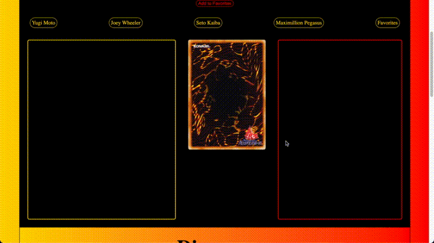
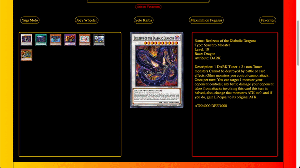
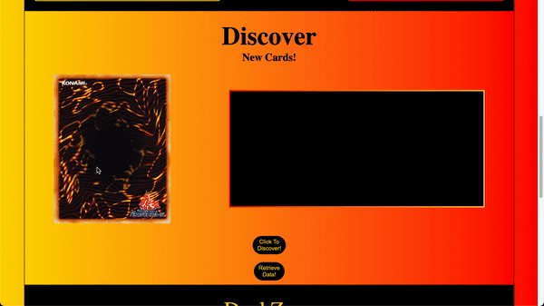
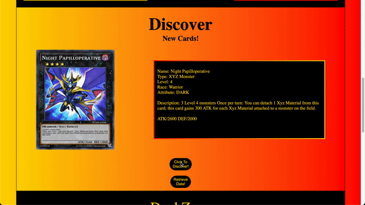
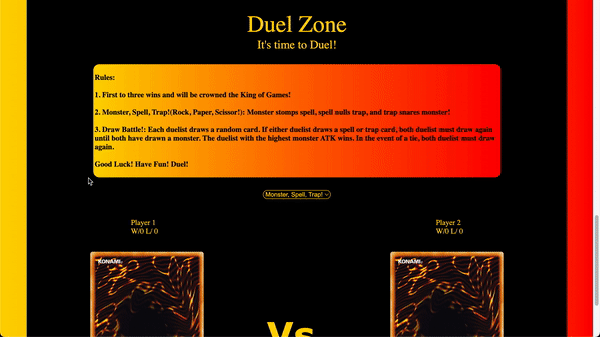

# Duel-Zone-Phase-1-Project

## Overview
This application introduces users to the Yu-Gi-Oh! Trading Card Game original four starter decks. It also grants users the ability to browse through Yu-Gi-Oh!'s library at random and favorite cards. And finally, users can play mini-games, keep score, and be crowned King of Games!

 

## Features and Description
- Navigate through starter sets and favorites, and on-click loads images of cards included in selected sets or favorited.

 

- Clicking on images loads larger images and a description of the card.

 

- Buttons, when clicked, load a random card from the Yu-Gi-Oh! Collection and retrieve information for the form.

 

- Submit form lets users add new cards to the 'Favorites' library.

 

- Rock, paper, scissor, and monster attack comparison games are available with a button, with scorekeeping available.

 


**LIVE LINK:** https://youtu.be/W8YZ4vwyx0A

## Installation

```
npm install -g json-server
```

## Authors and acknowledgment
All images used in this application belong rightfully to Konami Digital Entertainment, Inc and the Yu-Gi-Oh! Trading Card Game Company.

